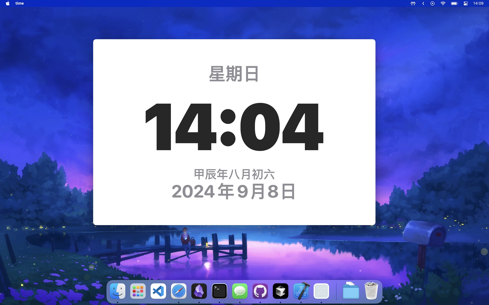

# time

此 app 只做一件事: 看时间.

## 如何安装

到 [releases](https://github.com/chen-bao-x/time/releases) 页面,  
找到最新的 Releases, time.dmg 下载后打开即可使用.

也可以将 time.dmg   
复制到你的 Application 文件夹夹内, 这样就可以同耕哦 Spotlight 或者 Raycast 来打开 time.app 了.

## 如何使用
